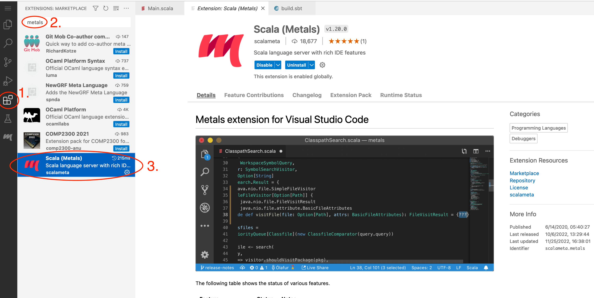
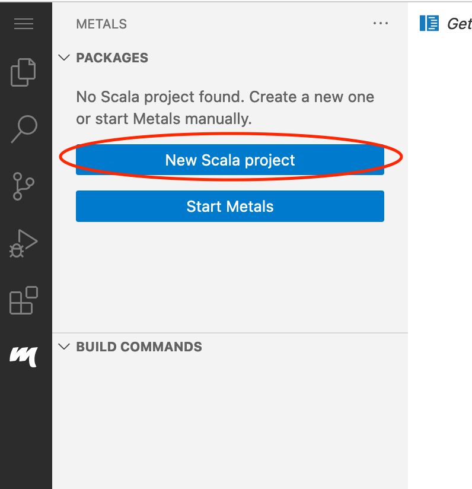

# Kafka Stream Word Counter Example (Scala)

This is a ready to run scala example for kafka streams API.

## Prepare VSC Code Server

Install Metals Extension:

After it is installed, try to create a new scala project, which will ask you to install Java:

